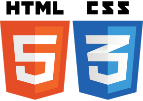

# Courses of HTML and CSS

 

Source code repository of projects made in HTML and CSS courses through video classes or books.

## Flexbox CSS Examples

> Folder: flexbox-samples

Some examples made by myself of flexbox layout.

Creator: José Ailton

## HTML5 e CSS3: Domine a web do futuro

> Folder: html5-css3-mazza

A Book about web technologies from Casa do Código.

Creator: Lucas Mazza